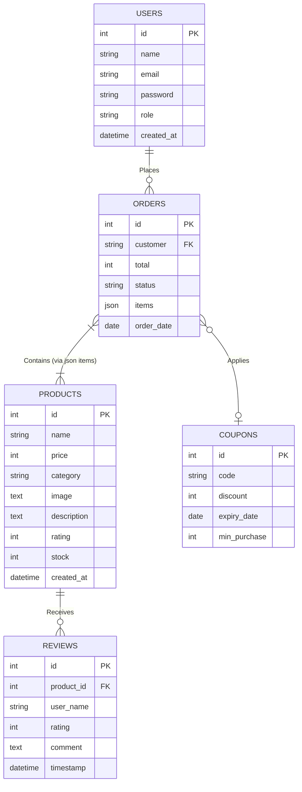

# LuxeHome E-Commerce Database - ER Diagram

> [!NOTE] 
> Below is the visual representation of the Entity-Relationship (ER) Diagram designed for the Luxima platform, demonstrating the connections between Products, Users, and Orders as referenced in the theoretical background.

## Key Entities and Relationships

1. **USERS**: The core entity representing registered customers and administrators. A User can place multiple **ORDERS** (1-to-Many).
2. **PRODUCTS**: Represents the premium inventory available. A Product can contain multiple **REVIEWS** (1-to-Many), and can be part of many **ORDERS**.
3. **ORDERS**: The transactional entity that links **USERS** with the items they purchased. Order items are stored efficiently in a JSON format referring back to **PRODUCTS**.
4. **COUPONS**: A secondary entity applied to **ORDERS** to provide promotional discounts based on conditions.
